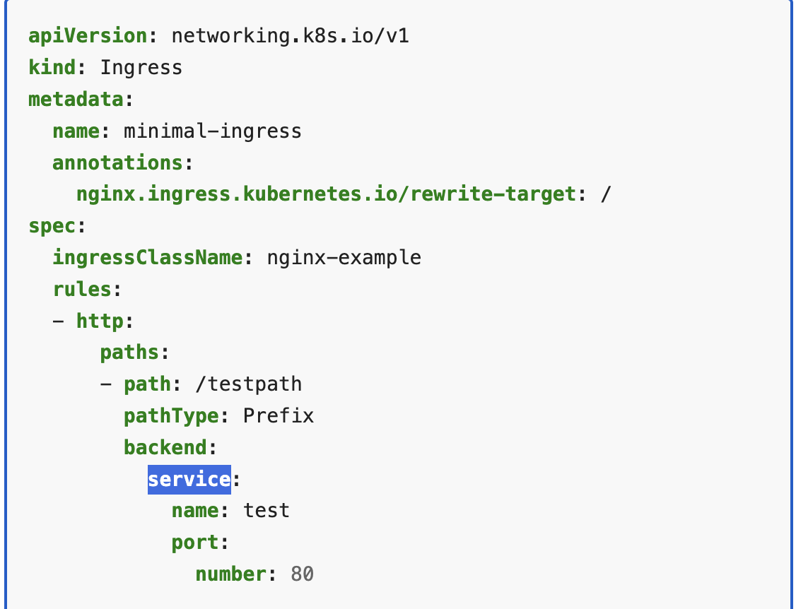

# Ingress
- use new syntax
- 
- also newer api version - check k8s docs for updated config
- might take some time to give ingress address
- added host name by going into `sudo vim /etc/hosts` 
- remove later on

### some companies might go for subdomain approach some may go for path based approach or a combination of both -> both examples are in ingress yaml
---
# POD
- for pods use `apiVersion: v1`